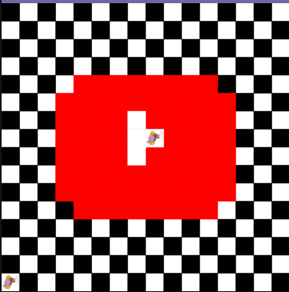
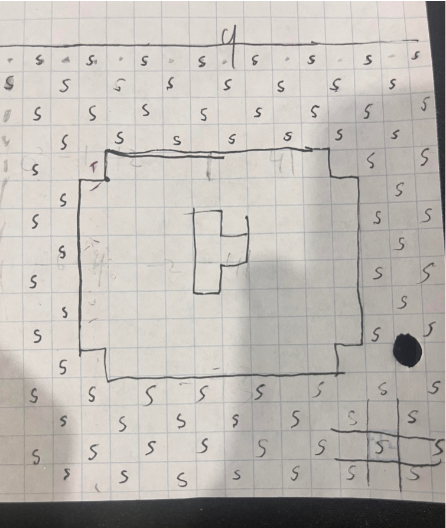

# Unit 1 - Asphalt Art

## Introduction

Cities use asphalt art to improve public safety, inspire their residents and visitors, and brighten communities. Your goal is to create asphalt art to revitalize The Neighborhood and bring the community together with the help of the Painter.

## Requirements

Use your knowledge of object-oriented programming, algorithms, the problem solving process, and decomposition strategies to create asphalt art:
- **Create a new subclass** – Create at least one new subclass of the PainterPlus class that is used for a component of the asphalt art design.
- **Plan an algorithm** – Use the problem solving process and decomposition strategies to plan an algorithm that incorporates a combination of sequencing, selection, and/or iteration.
- **Write a method** – Write at least one method in a PainterPlus subclass that contributes to a component of the asphalt art design.
- **Document your code** – Use comments to explain the purpose of the methods and code segments.

## Notes: Neighborhood & Painter Class

This project was created on Code.org's JavaLab platform using the built in Neightborhood GUI output. To test and edit this project you must build in Code.org's JavaLab with the Neighborhood GUI enabled. For reference to the Painter class documentation, [you can read more here.](https://studio.code.org/docs/ide/javalab/classes/Painter)

## Output:

< Put sketch / Final image here >   

## Reflection

1. Describe your project.

   - Write your response here: my project creates a youtube logo with a backroung of checkered patterns. It does this by using if statements and while loops. The painter first paints a white backround as a base coat and then returns throught the start of the program and paints a checker pattern over it. After this is ran it then initiates another painter in order to paint the actual youtube logo. There are two parts to this logopainter. The logo and Play button. The logo paitner paints the red backroung of the logo while the play button paints the white star in the middle.

2. What are two things about your project that you are proud of?

   - Write your response here: one thing that I am proud of is that it actually works and the second thing I am proud of is that the result was the desired outcome. 

3. Describe something you would improve or do differently if you had an opportunity to change something about your project.

   - Write your response here... Something I would do differently if I had an oppertunity to change it is find a way to compress the iff statements given their extensive lenght.
